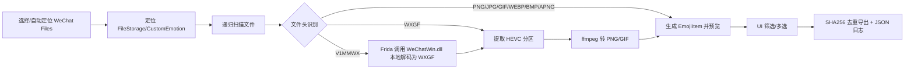

# 技术说明

## 核心流程



## 目录定位

`core/utils.py` 中的 `candidate_custom_emotion_dirs()` 和 `autodetect_custom_emotion_dirs()` 只返回微信自定义表情目录：

```text
...\WeChat Files\wxid_xxx\FileStorage\CustomEmotion
```

不会扫描 `FileStorage\Temp`、`MsgAttach`、`Image` 等聊天/缓存图片目录。

## 图片格式识别

`core/format_detector.py` 使用文件头/魔数识别，而不是依赖扩展名：

| 格式 | 魔数 |
|---|---|
| PNG/APNG | `89 50 4E 47 0D 0A 1A 0A` |
| JPG/JPEG | `FF D8 FF` |
| GIF | `GIF87a` / `GIF89a` |
| WEBP | `RIFF....WEBP` |
| BMP | `BM` |
| V1MMWX | `V1MMWX` |
| WXGF | `wxgf` |

APNG 通过 PNG 头和 `acTL` chunk 判断。

## V1MMWX 解码

`core/v1mmwx_decoder.py` 通过 Frida attach 到本机正在运行的微信进程，调用 `WeChatWin.dll` 内部解码函数，把 V1MMWX 转为 WXGF。

当前已验证：

```text
WeChat 3.9.12.57
DECODER_RVA = 0x21CA860
```

其他版本不会盲目调用，会在 UI 和日志中提示未验证，避免错误地址导致崩溃。

> 登录问题说明：如果新设备无法登录 3.9.12，可用最新版微信负责官方扫码登录和生成本地文件；旧版 3.9.12.57 只作为本地解码进程使用。

## WXGF 转换

`core/wxgf_converter.py` 负责：

1. 识别 WXGF 容器；
2. 查找 HEVC/H265 分区；
3. 用 ffmpeg 输出：
   - 静态图：首帧 PNG；
   - 动图：GIF；
   - GIF 失败时回退为首帧 PNG。

ffmpeg 查找顺序：

1. 打包后的 `_MEIPASS/tools/.../ffmpeg.exe`；
2. 文件夹版 `_internal/tools/.../ffmpeg.exe`；
3. 源码目录 `release_assets/ffmpeg.exe`；
4. 源码目录 `third_party/ffmpeg/ffmpeg.exe`；
5. 系统 PATH 中的 `ffmpeg`。

## UI 与线程

- UI：PySide6；
- 扫描：`QThread + ScanWorker`；
- 导出：`QThread + ExportWorker`；
- 缩略图：`QImageReader` 读取首帧并缩放；
- 网格刷新做了节流，避免大量表情卡顿。

## 导出与日志

导出命名：

```text
emoji_0001_哈希前8位.png
emoji_0002_哈希前8位.gif
```

去重策略：

- SHA256 判断重复；
- 本次导出内重复会跳过；
- 导出目录已有相同 SHA256 文件也会跳过。

日志：

```text
export_log.json
```

记录：

- 原始路径；
- 导出路径；
- 文件格式；
- 文件大小；
- SHA256；
- 是否重复；
- 状态；
- 失败原因。
